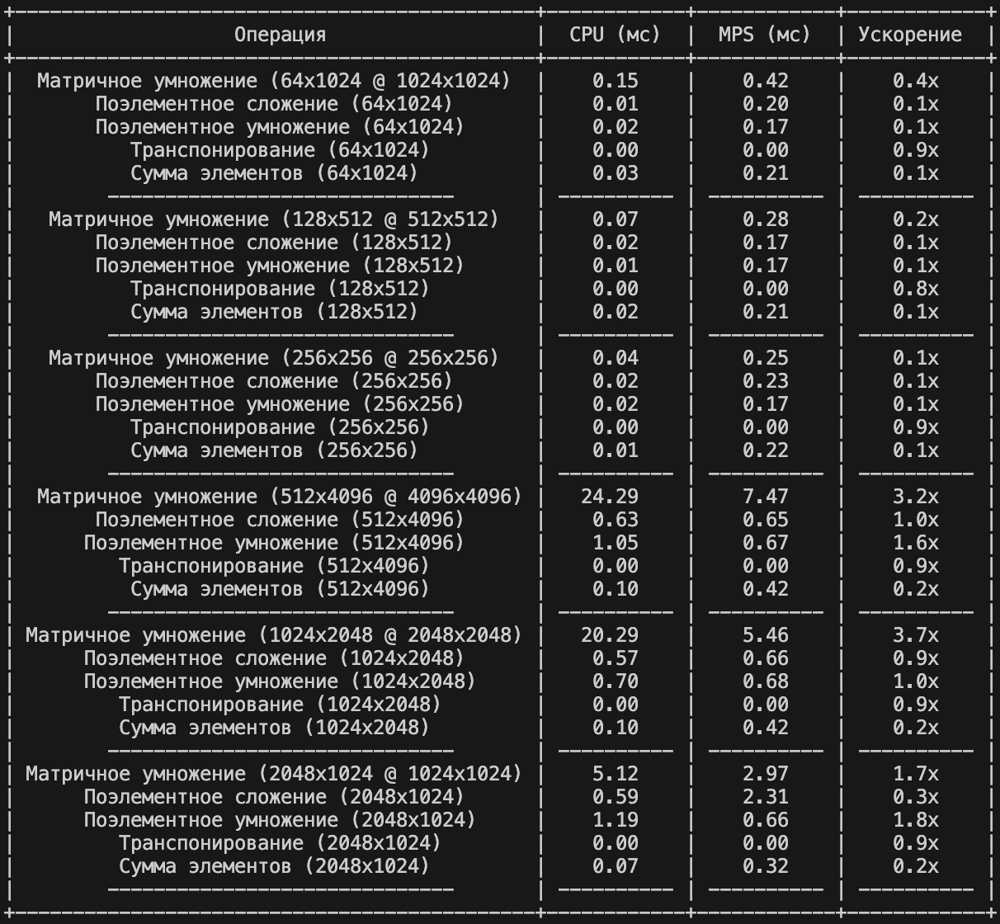

# Отчет по Домашнему Заданию №1: Основы PyTorch

Студент:**Маслов Андрей Анатольевич**

Дата выполнения:**31 июня 2025**

Среда выполнения:**macOS (Apple M2), VS Code, PyTorch с поддержкой MPS**

### Цель задания
Закрепить навыки работы с тензорами PyTorch, изучить основные операции и научиться решать практические задачи.

## Задание 1: Создание и манипуляции с тензорами (homework_tensors.py)
Закрепил практические навыки работы с тензорами PyTorch. Создал тензоры различных типов, выполнил базовые математические операции, а также сложные операции индексации, срезов и изменения формы.

## Задание 2: Автоматическое дифференцирование(homework_autograd.py)
Закрепил autograd на простых функций и функции потерь. Провел стравнение вычеслений PyTorch и аналитической проверки результатов, оно оказалось успешным.

## Задание 3: Сравнение производительности CPU vs CUDA(MPS) (homework_performance.py)
Работа выполнялась на macOS, вместо cuda использовал mps.

Я заметил что при выполнении заданий на cpu и mps, время выполнения MPS больше, чем CPU. Поэтому помимо матриц размеров:
- 64 x 1024 x 1024
- 128 x 512 x 512
- 256 x 256 x 256
Я добавил:
- 512 x 4096 x 4096
- 1024 x 2048 x 2048
- 2048 x 1024 x 1024
для более глубокого анализа. 

### **Результат**:

Я использовал модуль prettytable для построения удобной и красивой таблицы.

После выполнения заданий для добавленных матриц стало видно, что Матричное умножение стало быстрее на MPS. Это подтверждает, что для действительно вычислительно интенсивных задач GPU(MPS) начинает выигрывать. Однако для малых матриц (64x1024, 128x512, 256x256) и для большинства **поэлементных операций** (сложение, умножение) и **суммирования элементов**, CPU оказался быстрее MPS. Это происходит из-за **накладных расходов**. Запуск GPU-ядер, синхронизация между CPU и GPU и особенности внутренней архитектуры MPS для определенных операций могут вносить задержки. Для очень быстрых операций, которые CPU может выполнить за доли миллисекунды, эти накладные расходы на MPS могут превысить выгоду от параллелизма. 

Результат показывает, чем больше размер матриц, тем вероятнее MPS покажет ускорение. По мере увеличения размера матриц, объем вычислений возрастает, и GPU может использовать свой параллелизм, перевешивая эти накладные расходы и демонстрируя преимущество. Например, матричное умножение 64x1024 MPS замедляло CPU (0.3x), тогда как 512x4096 уже ускоряло (2.9x).

## Вывод:
Результаты показывают, что GPU (MPS) не является универсальным ускорителем для всех операций. Его сила заключается в масштабных, параллельных вычислениях, таких как матричное умножение. Для более "легких" или Memory-Bound операций, или для очень малых размеров данных, высокооптимизированный CPU Apple Silicon может быть более эффективным. Эти результаты подчеркивают важность понимания архитектуры и характеристик различных операций при оптимизации производительности в PyTorch.
