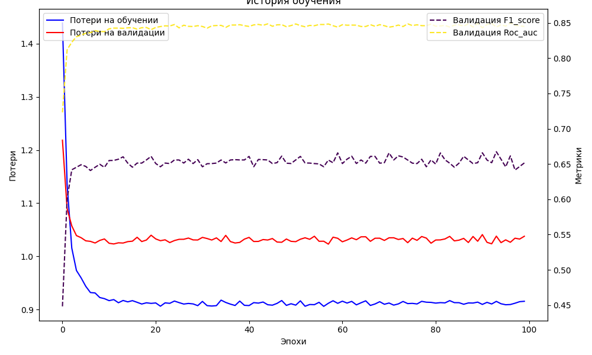
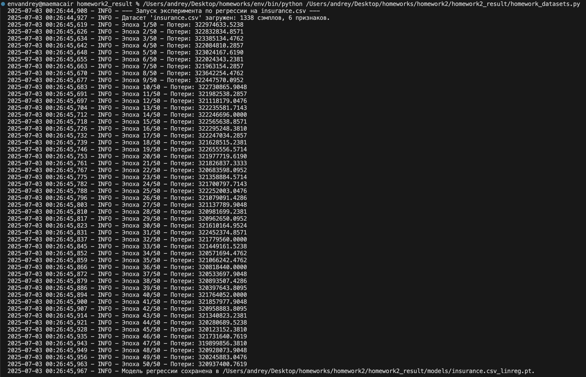

# Отчет по Домашнему Заданию №2: Линейная и логистическая регрессия

Студент:**Маслов Андрей Анатольевич**

Дата выполнения:**02 июля 2025**

Среда выполнения:**macOS (Apple M2), VS Code**

### Цель задания
Закрепить навыки работы с PyTorch API, изучить модификацию моделей и работу с различными датасетами.

## Задание 1: Модификация существующих моделей (homework_model_modification.py)
В этом залании я расширил функционал базовых моделей.

### **1.1 Линейная регрессия**
Я добавил L1/L2 регуляризации для контроля переобучения и раннюю остановку в модель.

Логи линейной регресии:

Обучение началось с высоких потерь, которые быстро снижались. После 13-й эпохи потери на валидации перестали улучшаться, и счетчик EarlyStopping начал расти. На 23-й эпохе обучение было остановлено.

График линейной регресии:

График линейной регрессии подтверждает это. Кривые потерь на обучающей и валидационной выборках резко идут вниз и становится горизонтальной(плато), обучение прекращается.

### **1.2 Расширение логистической регрессии**
Я переписал логистич. регрессию в Softmax регрессию для многоклассовой классификации и добавил расчет precision, recall, F1, ROC-AUC и визуализацию матрицы ошибок.

Логи Softmax регрессии:

Логи каждой эпохи показывают снижение потерь и рост метрик качества.

График Softmax регрессии:

График Softmax регрессии показывает одновременное снижение кривых потерь и рост кривых метрик F1-score и ROC-AUC.

График матрицы ошибок:

Матрица ошибок показывает высокую точность модели: большинство значений сосредоточено на главной диагонали, значит малое кол-во ошибок классификации.

## Задание 2: Работа с датасетами (homework_datasets.py)
В этом задании реализовал обработку реальных данных в CSV с помощью кастомного класса CSVDataset.

Я создал CSVDataset, который автоматически загружает, предобрабатывает и готовит данные для PyTorch. При запуске homework_datasets.py лог показал, что оба датасета (insurance.csv и breast-cancer.csv) были успешно загружены и обработаны.

Логи:

Логи:

Для обеих задач лог выводил стабильное уменьшение потерь (loss) на каждой эпохе.

## Задание 3: Эксперименты и анализ (homework_experiments.py)
В этом задании я провел эксперименты для поиска оптимальных параметров и улучшения качества моделей.

### **3.1 Исследование гиперпараметров**
Провел систематический перебор оптимизаторов, скоростей обучения и размеров батчей.

Логи Исследования гиперпараметров:

График Исследования гиперпараметров:

График четко показывает, что оптимизаторы Adam и RMSprop эффективнее и имеют меньшие потери, чем SGD для данной задачи.

### **3.2 Feature Engineering**
Провел эксперимент по созданию полиномиальных признаков и сравнению модели на их основе с базовой.

Логи Feature Engineering:

График Feature Engineering:

Столбец потерь для модели с новыми признаками значительно ниже, чем у базовой модели.
Это доказывает, что для данной синтетической задачи инжиниринг признаков эффективен методом улучшения качества модели.

# Общие выводы
В ходе выполнения работы были успешно решены все поставленные задачи. Анализ логов и графиков подтвердил корректность реализованных улучшений: ранняя остановка предотвращает переобучение, метрики хошошо оценивают качество, а эксперименты с гиперпараметрами и признаками позволяют находить пути к созданию более точных моделей.
