# Отчет по Домашнему Заданию №3: Полносвязные сети

Студент: **Маслов Андрей Анатольевич**

Дата выполнения: **02 июля 2025**

Среда выполнения: **macOS (Apple M2), VS Code**

## Цель задания
Изучить влияние архитектуры полносвязных сетей на качество классификации, провести эксперименты с различными конфигурациями моделей.

## Задание 1: Эксперименты с глубиной сети (homework_depth_experiments.py)

В этом задании были сравнены модели с разным кол-вом слоев для анализа влияния глубины на точность и переобучение.

### Результат:
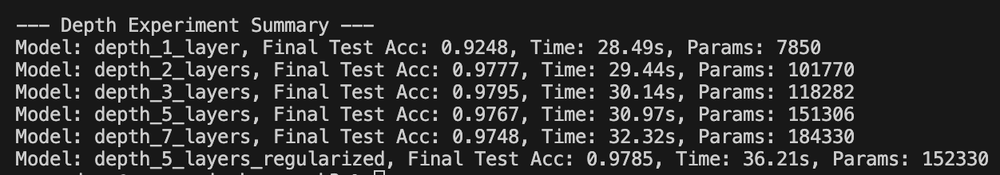
Подробные выводы в папке result_screenshots

### Анализ и графики:

**Оптимальная глубина:** Наилучшая точность (97.95%) получилась на модели с 3-мя слоями. Дальнейшее увеличение глубины без регуляризации привело к ухудшению результата.

**Переобучение:** С увеличением глубины выросла разница между точностью на обучающей и тестовой выборках, это признак переобучения.

**Регуляризация:** После добавления слоев BatchNorm и Dropout в 5-слойную модель получилось побороть переобучение и улучшить итоговую точность по сравнению с 5-слойной без регуляризации.

| Модель с 1 слоем (Линейная модель) | Модель с 2 слоями (Значитель прирост) |
| :---: | :---: |
| 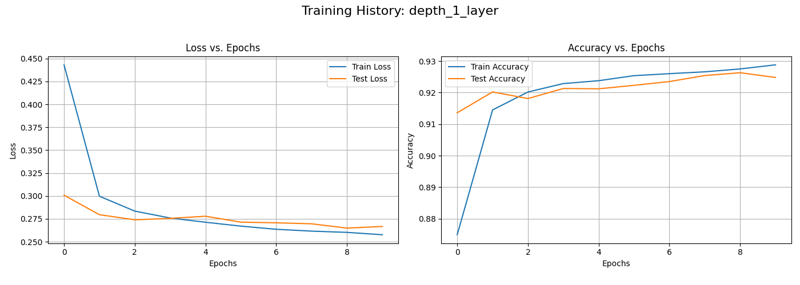 | 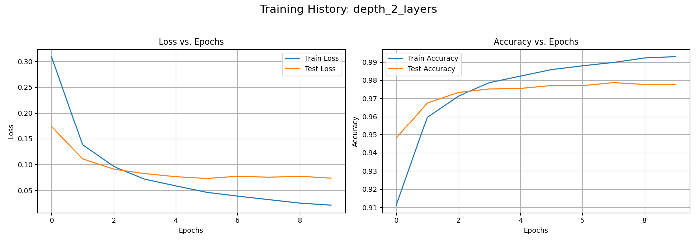 |

| Модель с 3 слоем (Оптимальная глубина) | Модель с 5 слоями (Избыточная глубина) |
| :---: | :---: |
| 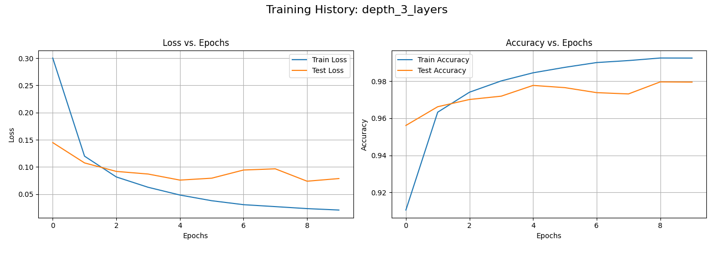 | 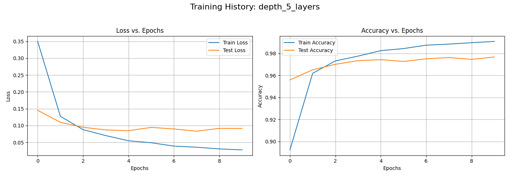 |

| Модель с 7 слоями (Переобучение) | 5-слойная модель с регуляризацией |
| :---: | :---: |
|  | 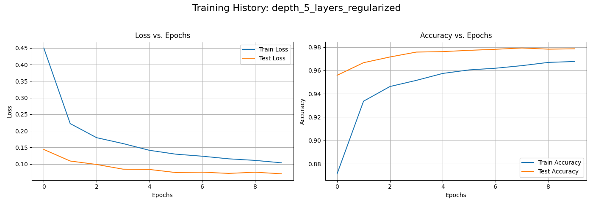 |

## Задание 2: Эксперименты с шириной сети (homework_width_experiments.py)

В этом задании я исследовал влияние кол-ва нейронов в слоях (ширины) на производительность и сложность модели.

### 2.1 Сравнение моделей разной ширины

### Результат:
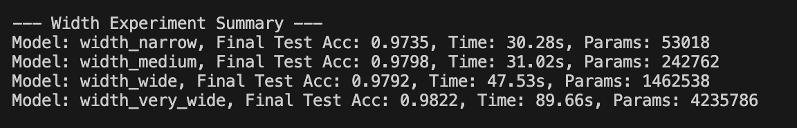
Подробные выводы в папке result_screenshots

### Анализ и графики:

**Точность vs Затраты:** Увеличение ширины стабильно увеличивает точность, но ценой экспоненциального роста числа параметров и времени обучения. Самая широкая модель - very_wide показала отличный результат (98.22%), но она слишком дорога.

**Архитектурные схемы:** Эксперименты с сужающейся, расширяющейся и постоянной по ширине архитектурами показали очень близкие результаты, это означает меньшую важность конкретной схемы по сравнению с общей мощностью сети.

| Узкая модель (narrow) | Средняя модель (medium) |
| :---: | :---: |
| 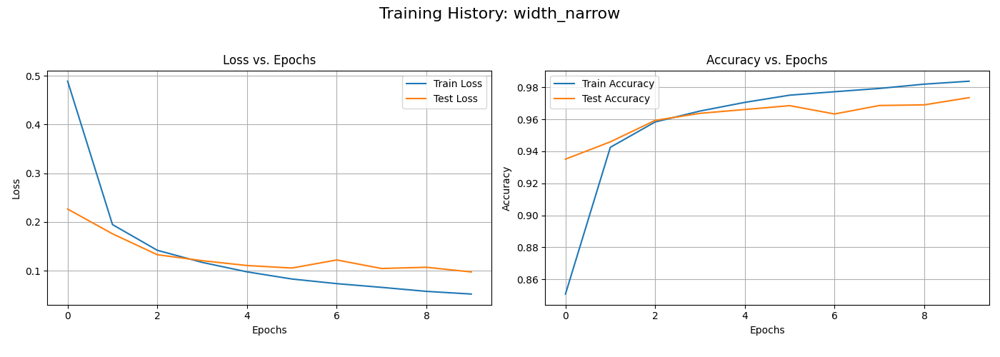 | 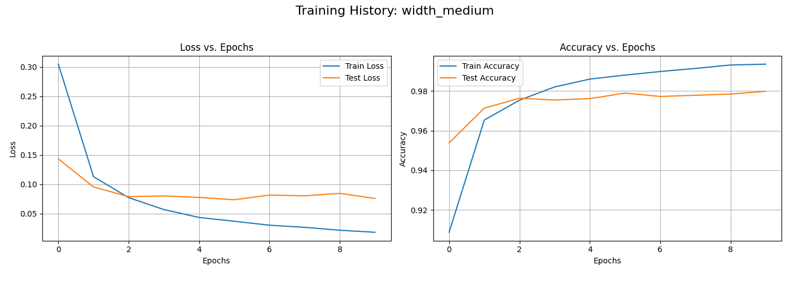 |

| Широкая модель (wide) | Очень широкая модель (very_wide) |
| :---: | :---: |
| 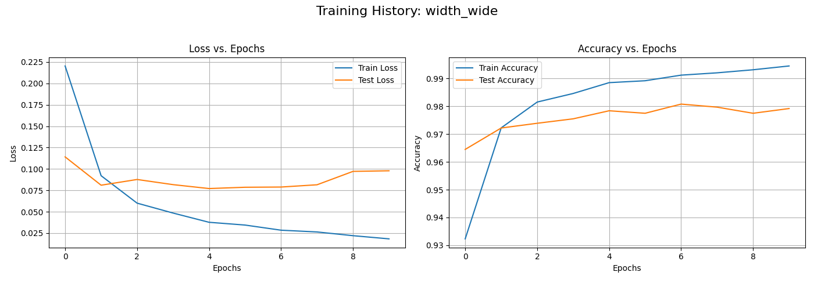 | 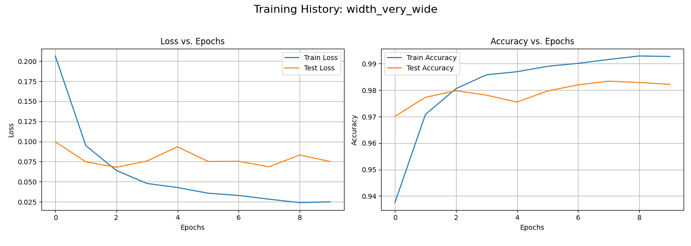 |

### 2.2 Оптимизация архитектуры
В этом эксперименте сравнивались три разные схемы изменения ширины слоев.

### Результат:
| grid_constant |
| :---: |
| 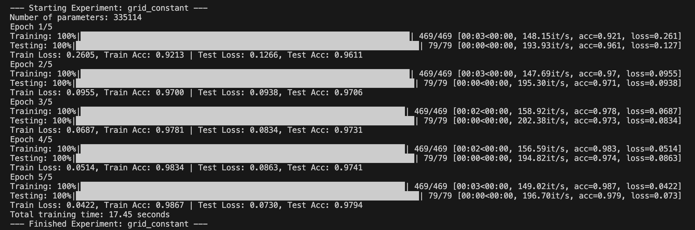 |

| grid_expanding |
| :---: | 
| 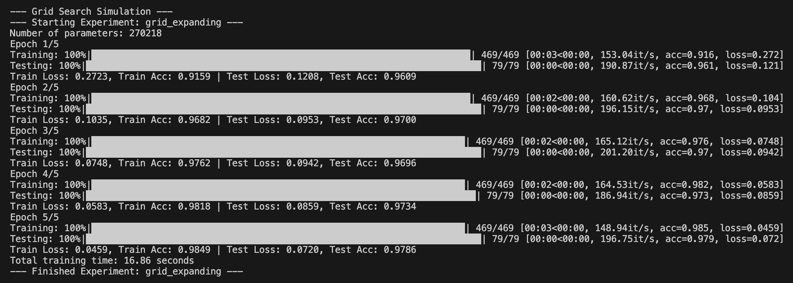 |

| grid_contracting |
| :---: |
| 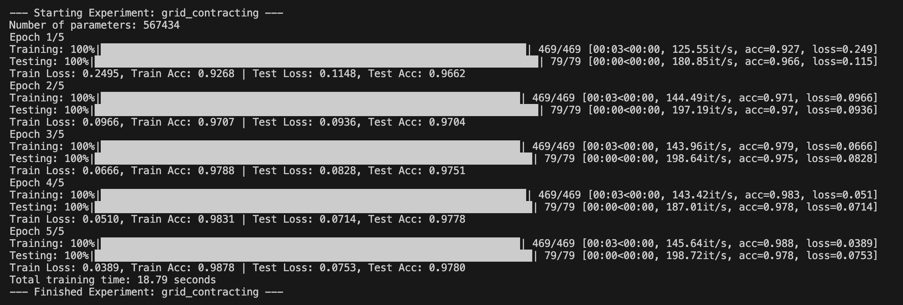 |

### Анализ и графики:

Все три схемы показали близкие результаты точности около 97.9%. Это говорит о том, что для данной задачи мощность сети оказалась важнее, чем конкретная схема их распределения по слоям.

| grid_constant |
| :---: | 
| 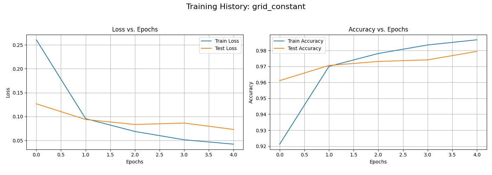 | 

| grid_expanding |
| :---: |
| 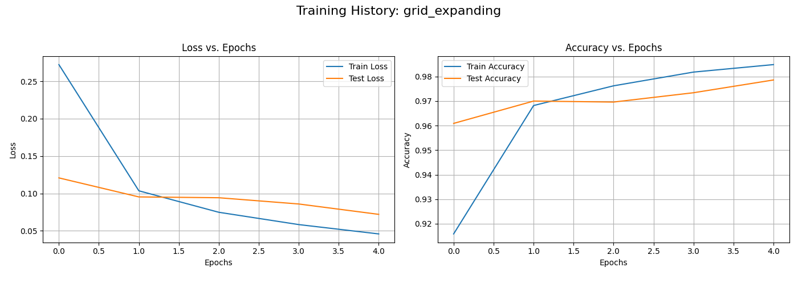 |

| grid_contracting |
| :---: |
| 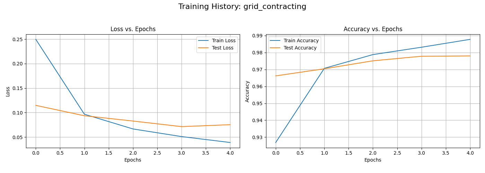 |

## Задание 3: Эксперименты с регуляризацией (homework_regularization_experiments.py)

В этоq задаче сравнивали различные техники регуляризации на одной и той же базовой архитектуре.

### Результат:
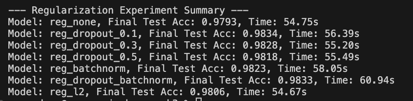
Подробные выводы в папке result_screenshots

### Анализ и графики

**Эффективность:** Абсолютно все техники регуляризации улучшили результат по сравнению с базовой моделью.

**Борьба с переобучением:** На всех графиках с регуляризацией видно, что кривые обучения для train и test выборок находятся гораздо ближе друг к другу, чем у модели reg_none.

**Сила комбинации:** Наилучший результат из всех проведенных экспериментов - 98.62%  показала модель с комбинацией Dropout и BatchNorm. Грамотное сочетание техник регуляризации эффективнее, чем простое наращивание размеров сети.

| Без регуляризации | Dropout (rate=0.1) |
| :---: | :---: |
| 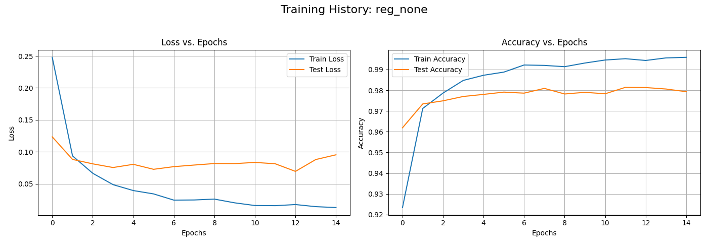 | 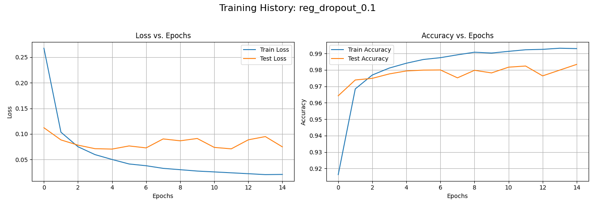 |

| Dropout (rate=0.3) | Dropout (rate=0.5) |
| :---: | :---: |
|  | 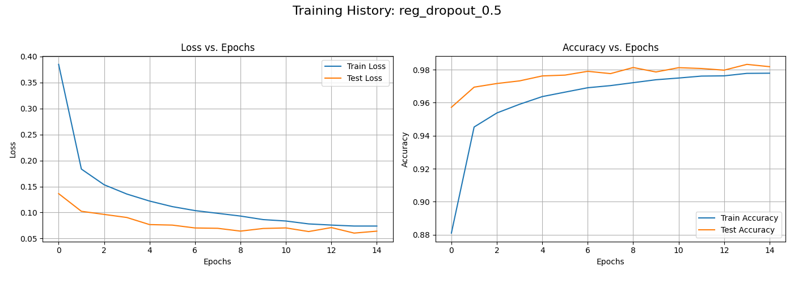 |

| BatchNorm | Dropout + BatchNorm (Лучшая модель) |
| :---: | :---: |
| 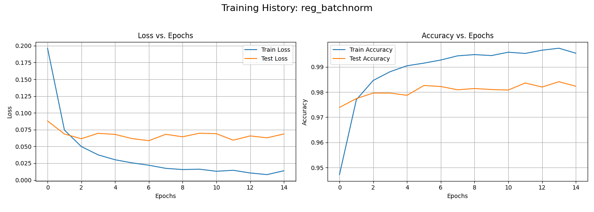 | 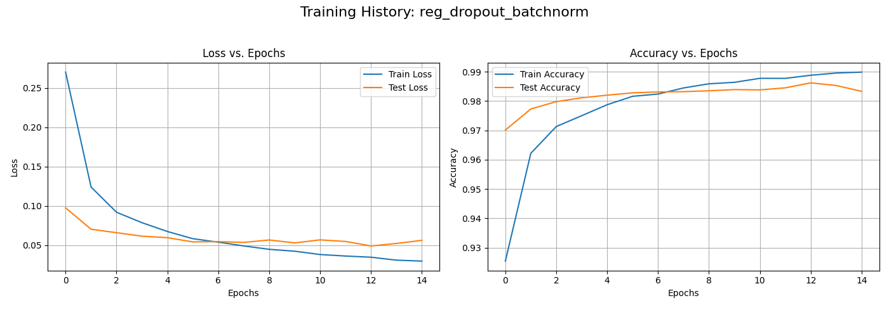 |

| L2 |
| :---: |
| 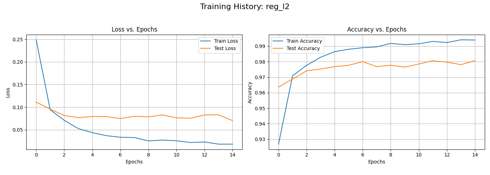 |

## Общий вывод
В ходе выполнения работы были успешно решены все поставленные задачи. Анализ полученных данных и графиков обучения наглядно продемонстрировал ключевые аспекты построения нейронных сетей: эксперименты с глубиной показали наличие оптимального количества слоев и риск переобучения при избыточной сложности; опыты с шириной выявили компромисс между мощностью модели и вычислительными затратами; а сравнение техник регуляризации доказало, что их грамотное применение, особенно комбинации BatchNorm и Dropout, является наиболее эффективным путем к созданию точных и стабильных моделей.
