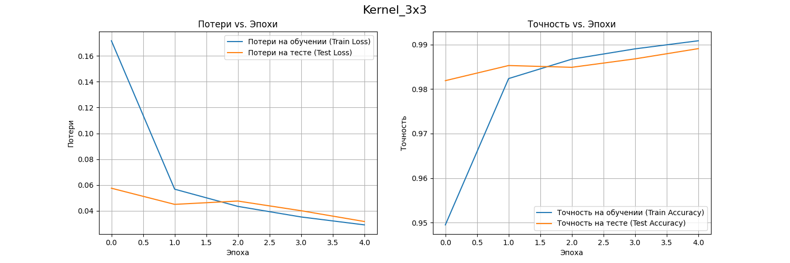

# Детальный отчет по Домашнему Заданию №4: Сверточные сети

Студент: **Маслов Андрей Анатольевич**

Дата выполнения: **06 июля 2025**

Среда выполнения: **macOS (Apple M2), PyTorch (MPS), VS Code**

## Цель задания
Сравнить эффективность сверточных и полносвязных сетей на задачах компьютерного зрения, изучить преимущества CNN архитектур.

## Задание 1: Сравнение CNN и полносвязных сетей (homework_cnn_vs_fc_comparison.py)
В этом задании сравнивалась производительность полносвязных и сверточных (CNN) сетей на датасетах MNIST и CIFAR-10 для оценки их сильных и слабых сторон.

### Результаты

Итоги сравнения MNIST:

Тут ошибка вывода для FC Accuracy - правильное значение в таблице

Итоги сравнения CIFAR-10:

| Модель | Датасет | Итоговая точность (тест) | Кол-во параметров | Время обучения|
| :--- | :--- | :--- |:--- | :--- |
| Полносвязная сеть | MNIST | 97.76% | 235,146 | 27.2 |
| **Простая CNN** | **MNIST** | **98.83%** | **20,490** | **51.7** |
| Глубокая FC сеть | CIFAR-10| 47.90% | 3,805,450 | 47.8 |
| **ResNet** | **CIFAR-10**| **70.33%** | **78,058**| **86.1**|

#### **Часть 1.1: Сравнение на MNIST**

На датасете MNIST обе архитектуры показали высокую точность.
Полносвязная сеть достигла точности **97.76%**, в то время как CNN показала результат **98.83%**. При этом CNN потребовалось всего **~20 тыс.** параметров, а полносвязной сети — **~235 тыс.**

MNIST: Полносвязная сеть 

MNIST: Простая CNN

Графики обеих моделей демонстрируют обучение с минимальным разрывом между кривыми обучения и теста. Это значит, что для MNIST обе модели хорошо обобщают данные без явного переобучения за 5 эпох.

#### **Часть 1.2: Сравнение на CIFAR-10**

На более сложном датасете CIFAR-10 с цветными изображениями разница в производительности стала колоссальной.
Глубокая полносвязная сеть с **3.8 млн** параметров показала очень слабую точность в **47.9%**. В то же время ResNet, имея всего **~78 тыс.** параметров , достигла точности **70.3%**. Это наглядно демонстрирует неспособность FC сетей эффективно работать с пространственной структурой изображений.

CIFAR-10: Глубокая FC сеть 

CIFAR-10: ResNet

На графике для Deep FC тест ведет себя нестабильно и находится значительно ниже обучения, это указывает на сильное переобучение. На графике ResNet тестовая точность следует за обучающей, значит гораздо лучше обобщающая способность модели.

## Задание 2: Анализ архитектур CNN (homework_cnn_architecture_analysis.py)
В этом задании исследовалось, как архитектурные решения — в частности, размер ядра свертки и глубина сети — влияют на производительность и процесс обучения.

#### **Часть 2.1: Влияние размера ядра свертки**
Сравнивнил три модели с одинаковой архитектурой, но разным размером ядра: 3x3, 5x5 и 7x7.

Результат:

3x3

5x5

7x7

Все три модели показали очень высокую точность, но с увеличением размера ядра итоговая точность на тесте повышается. Модель с ядром 7x7 показала лучший результат ~99.15%. Также наблюдается обратная тенденция. Чем больше размер ядра, тем больше становится разрыв между точностью на обучении и на тесте. Модель с ядром 3x3 показывает самое стабильное обучение с минимальным переобучением. Модель 7x7 переобучается сильнее всего.

Увеличение размера ядра дает мин прирост в качестве, но заметно увеличивает склонность модели к переобучению и кол-во параметров.

#### **Часть 2.2: Влияние глубины CNN**
Сравнил три модели с 2, 4 и 6 сверточными слоями.

Результат:

Глубина 2 слоя

Глубина 4 слоя

Глубина 6 слоя

Увеличение глубины с 2 до 4 слоев дает прирост точности (с ~98.4% до ~99.1%). Дальнейшее увеличение до 6 слоев также дает прирост (~99.2%). Все модели показывают достаточно стабильное обучение. Однако с увеличением глубины можно заметить, как кривая обучения начинает все больше "отрываться" от тестовой кривой, это говорит о начинающемся переобучении у более глубоких моделей.

Увеличение глубины является эффективным способом повышения производительности CNN, но каждая следующая пара слоев дает все меньший прирост к качеству.

## Задание 3: Кастомные слои и эксперименты (homework_custom_layers_experiments.py)
В этом задании провел сравнение различных типов остаточных блоков, а также тест по интеграции кастомного слоя `AttentionMechanism`.

**Сравнение кастомного слоя (Attention)**

**Сравнение Residual блоков**

#### **Часть 3.1: Тестирование кастомного слоя (Attention)**
Базовая модель ResNet - **78.46%**, в то время как модель с добавленным блоком внимания (`AttentionMechanism`) - **75.55%**.

#### **Часть 3.2: Сравнение Residual блоков**

**Wide_ResNet** лидер по точности (**80.1%**), но при этом имеет наибольшее кол-во параметров -**~697 тыс.**. **Basic_ResNet** показал точность **76.75%** при **~175 тыс.** параметров. **Bottleneck_ResNet** показал худший результат (**73.22%**) при большем кол-ве параметров **~220 тыс.**, чем у Basic_ResNet.

Базовый ResNet

**Wide_ResNet**: График показывает наиболее уверенный рост точности, что объясняется его повышенной "мощностью" за счет большего числа каналов.

**Bottleneck_ResNet**: Его низкая производительность — самый поучительный результат. Архитектура "бутылочного горлышка" (1x1 -> 3x3 -> 1x1 свертки) была создана для экономии вычислений в **очень глубоких** сетях. В нашей неглубокой модели этот механизм оказался неэффективным "крюком", который добавил параметров, но ограничил поток информации, что привело к ухудшению качества.

## Общий вывод
В ходе выполнения работы были успешно решены все поставленные задачи. Анализ экспериментов наглядно продемонстрировал фундаментальные преимущества сверточных сетей над полносвязными в задачах компьютерного зрения, особенно их **параметрическую эффективность** и способность изучать пространственные иерархии. Исследование различных архитектур показало, что производительность зависит от контекста: не существует одного лучшего блока или подхода, и выбор архитектуры всегда является **компромиссом** между точностью, сложностью и вычислительными затратами.