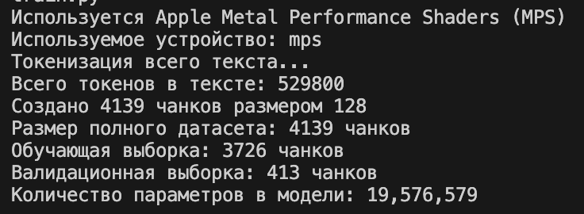
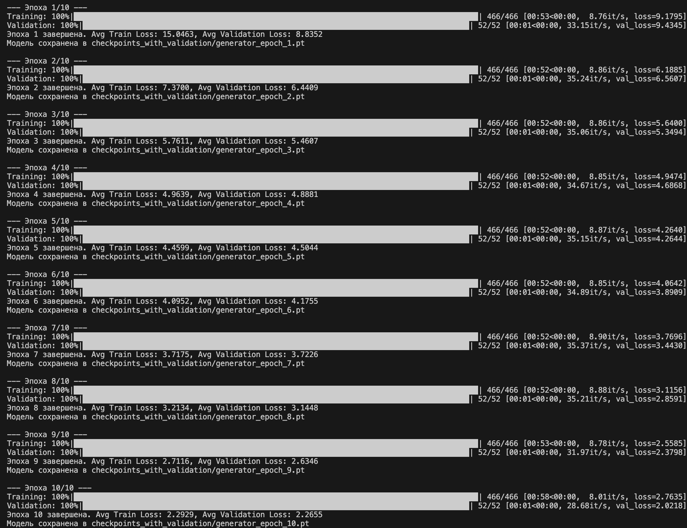
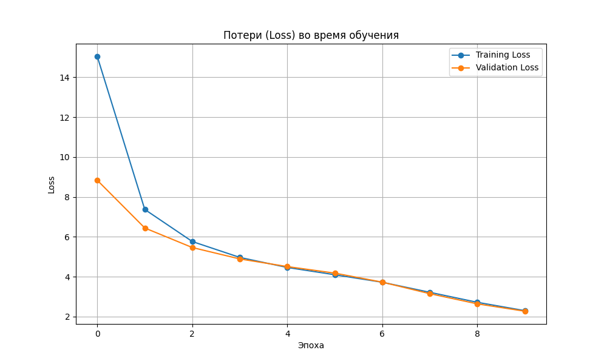
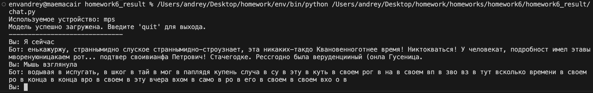
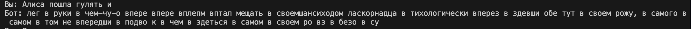

# Отчет по Домашнему Заданию №6: Генератор текста на базе Transformer

Студент: **Маслов Андрей Анатольевич**

Дата выполнения: **12 июля 2025**

Среда выполнения: **macOS (Apple M2), PyTorch (MPS), VS Code**

## Задача
Создайте генератор текста на базе архитектуры Transformer, используя только декодер. Модель должна генерировать ответы авторегрессивно, предсказывая следующее слово на основе контекста.

## Архитектура модели и подготовка данных
Данные для датасеты взял с 2ух книг: "Алиса в стране чудес" и "Преступление и наказание"
Реализовал архитектуру модели и подготовил пайплайн для обработки текстовых данных.
Была создана модель GeneratorTransformer, основанная на декодерных слоях (DecoderOnlyLayer). Отличие от полного Transformer'а — отсутствие энкодера и механизма cross-attention. Каждый слой модели состоит из Masked Self-Attention: Механизм внимания, где каузальная маска не позволяет модели "подглядывать" в будущие токены при обучении и Feed-Forward Network: Стандартная полносвязная сеть для дальнейшего преобразования признаков.

Для обучения был создан класс TextDataset, который читает несколько текстовых файлов для создания единого корпуса и использует токенизатор (mistral_tokenizer.json) для преобразования текста в последовательность токенов. Нарезает весь корпус на фрагменты (чанки) фиксированной длины (max_length). Этот метод позволяет модели эффективно обучаться на больших объемах текста в формате предсказания следующего слова.

## Обучение модели и анализ метрик
Обучил модель на датасете с одновременным отслеживанием метрик на обучающей и валидационной выборках на 10 эпохах. 

### Результат:

#### Разбивка датасета:

#### Процесс обучения:

#### График потерь:

Training Loss и Validation Loss стабильно снижаются на протяжении 10 эпох, это говорит об успешном усвоении моделью закономерностей из текста. Кривые идут очень близко друг к другу, и Validation Loss не начинает расти. Это означает, что модель не переобучилась и хорошо обобщает данные.

## Авторегрессивная генерация текста
Провел проверку способности обученной модели генерировать связный текст в интерактивном режиме.
В классе GeneratorTransformer был реализован метод generate, который работает по авторегрессионному принципу:
На вход подается начальная фраза (промпт).
Модель предсказывает один следующий токен.
Предсказанный токен добавляется в конец последовательности.

Процесс повторяется, но на каждом новом шаге используется обновленная последовательность. Для контроля длины контекста применяется механизм "скользящего окна", который оставляет только N последних токенов, что предотвращает переполнение памяти и соответствует макс длине, на которой обучалась модель.

Даже при факте обучения всего на 10 эпохах на относительно небольшом и несовсем корректно построенном датасете, результат неплохой. модель может формулировать некоторые слова и иногда выстраивать логические действия. Вот к примеру он понял что после и подразумевается действие.

## Общий вывод
В ходе выполнения домашнего задания была успешно реализована и обучена генеративная модель на архитектуре "decoder-only Transformer". Была создана архитектура, реализован пайплайн данных, проведено обучение с валидацией и продемонстрирована способность модели к авторегрессивной генерации. Эксперименты показали, что даже с ограниченными ресурсами модель способна улавливать базовую лонику текста.